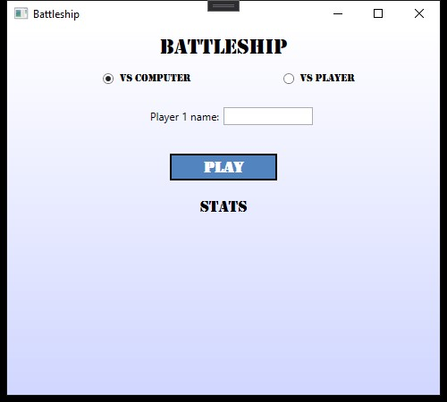

# Battleship

Egy közismert és egyszerű játék implementálása C# nyelven.


## Fejlesztéshez használt IDE

[Visual Studio IDE](https://visualstudio.microsoft.com/)


## Szerzők

- [@Roxor456](https://github.com/Roxor456) - Ladányi Dávid
- [@polonkaipal](https://github.com/polonkaipal) - Polonkai Pál
- [@Szasa40](https://github.com/Szasa40) - Váradi Sándor


## Badges


## Demo

Todo
## Dokumentáció

Todo
## Features

Todo
## Licensz

[MIT](https://github.com/polonkaipal/CSharp-Projekt/blob/main/LICENSE)


## Fordítás + futtatás

Klónozd le a projektet

```bash
  git clone https://github.com/polonkaipal/CSharp-Projekt
```

Indítsd el a solution fájlt

```bash
  ./Battleship.sln
```


## Képernyőképek

### Induló ablak



### Hajók elhelyezése


Todo
